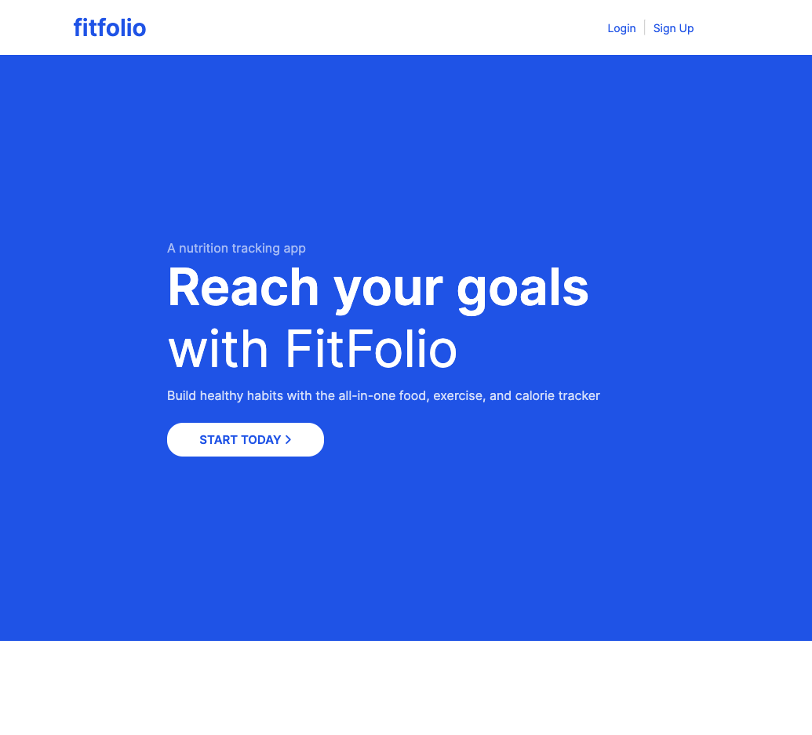
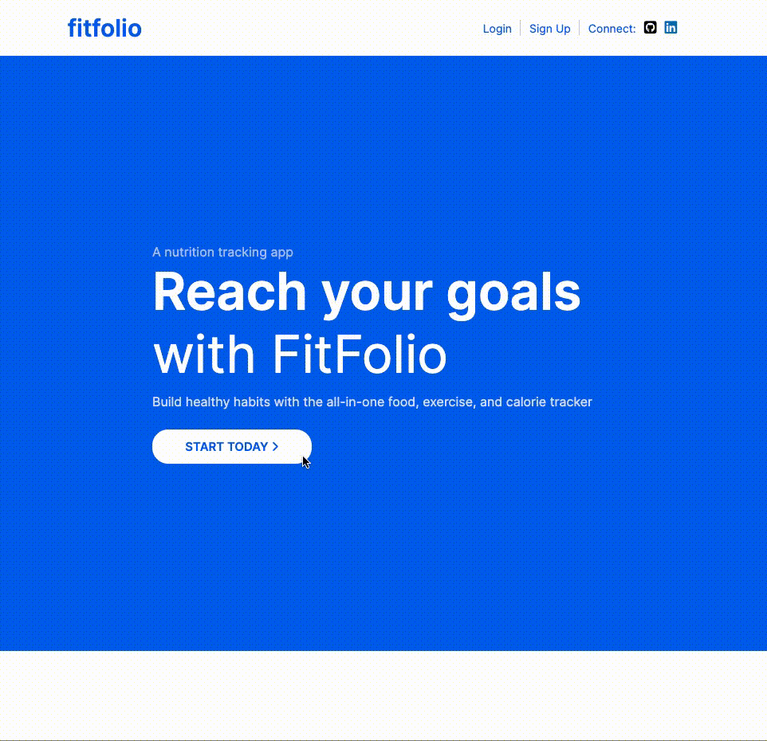
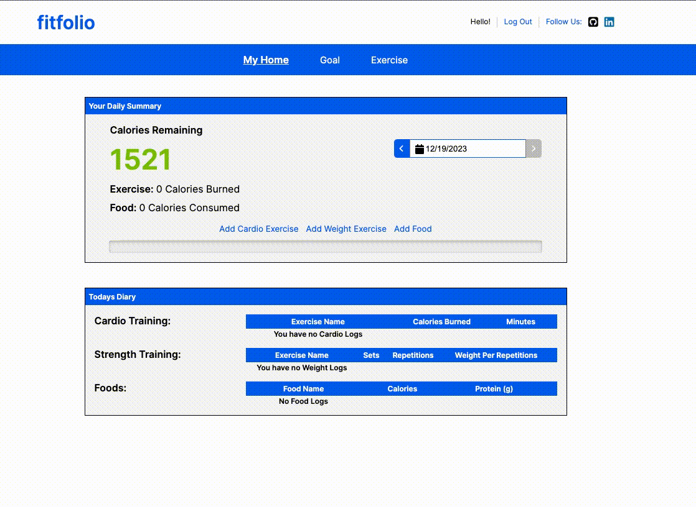
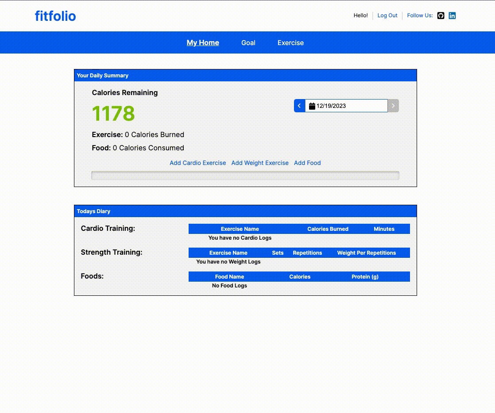

# FitFolio

Hello from FitFolio, your vibrant hub for a healthier lifestyle! Immerse yourself in a curated community where fitness enthusiasts converge to acquire and exchange empowering choices. From personalized nutrition tracking to seamless exercise logging, FitFolio offers a tailored experience for all health goals. Join us on this exhilarating adventure into the heart of wellness, where every mindful choice contributes to a tapestry of personal triumphs. Celebrate your journey at FitFolio, fostering a supportive community that cheers for every step, lift, and achievement. Indulge your passion for well-being, and let every rep and achievement tell your unique story of vitality!

## How to Use

1. Visit [FitFolio](https://fitfolio-f7l3.onrender.com)
2. Register for a new account or log in to your existing account.
3. Navigate to the nutrition tracking section to log your daily calorie intake.
4. Navigate to the exercise logging section to log your cardio and weight training sessions.

## Features

* Personalized nutrition tracking: Keep track of your daily calorie intake and monitor your diet.
* Exercise logging: Log your cardio and weight training sessions and track your progress over time.

## Technologies Used
##### Frontend
   
##### Backend
 

##### Database, Deployment and Hosting
 
 
 

## Index
* [Feature List](https://github.com/zohaibrajan/FitFolio/wiki/Features-List)
* [Database Schema](https://github.com/zohaibrajan/FitFolio/wiki/Features-List)
* [User Stories](https://github.com/zohaibrajan/FitFolio/wiki/User-Stories)
* [Wireframes](https://github.com/zohaibrajan/FitFolio/wiki/Wire-Frames)

## API Endpoints
| Endpoint                                      | API Route                       | Description                               |
| --------------------------------------------------- | ------------------------------- | ------------------------------------------------- |
| **GET All Users:**                                | `/api/users`                    | Returns a list of all users.                        |
| **GET Specific User:**                            | `/api/users/<int:userId>`       | Returns information about a specific user.          |
| **GET User's Cardio Logs:**                       | `/api/users/cardio-logs/<string:date>` | Returns all cardio logs logged by the current user on a given date. |
| **GET Cardio Log by ID:**                         | `/api/users/cardio-logs/<int:cardioLogId>` | Returns a cardio log logged by the current user.    |
| **POST Cardio Log:**                              | `/api/users/cardio-logs`        | Creates a cardio log for the current user.          |
| **PUT Cardio Log by ID:**                         | `/api/users/cardio-logs/<int:cardioLogId>` | Updates a cardio log logged by the current user.    |
| **DELETE Cardio Log by ID:**                      | `/api/users/cardio-logs/<int:cardioLogId>` | Deletes a cardio log logged by the current user.    |
| **GET Weight Logs:**                              | `/api/users/weight-logs/<string:date>` | Returns all weight logs logged by the current user on a given date. |
| **GET Weight Log by ID:**                         | `/api/users/weight-logs/<int:weightLogId>` | Returns a weight log logged by the current user.    |
| **POST Weight Log:**                              | `/api/users/weight-logs`        | Creates a weight log for the current user.          |
| **PUT Weight Log by ID:**                         | `/api/users/weight-logs/<int:weightLogId>` | Updates a weight log logged by the current user.    |
| **DELETE Weight Log by ID:**                      | `/api/users/weight-logs/<int:weightLogId>` | Deletes a weight log logged by the current user.    |
| **GET Food Logs:**                                | `/api/users/food-logs/<string:date>` | Returns all food logs logged by the current user on a given date. |
| **GET Food Log by ID:**                           | `/api/users/food-logs/<int:foodLogId>` | Returns a food log logged by the current user.      |
| **POST Food Log:**                                | `/api/users/food-logs`          | Creates a food log for the current user.            |
| **PUT Food Log by ID:**                           | `/api/users/food-logs/<int:foodLogId>` | Updates a food log logged by the current user.      |
| **DELETE Food Log by ID:**                        | `/api/users/food-logs/<int:foodLogId>` | Deletes a food log logged by the current user.      |

### Landing Page

### Sign-up Page

### Home Page / Diary

### Goal Page

### Let's Connect

