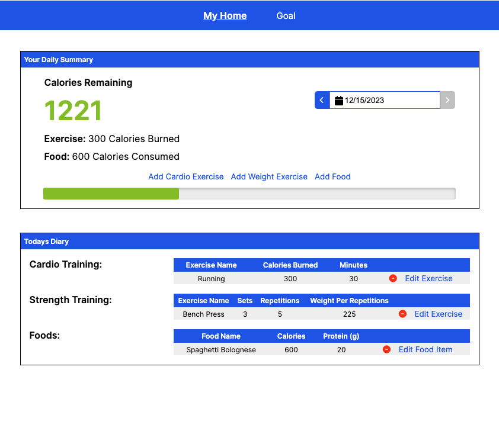

# FitFolio

Hello from FitFolio, your vibrant hub for a healthier lifestyle! Immerse yourself in a curated community where fitness enthusiasts converge to acquire and exchange empowering choices. From personalized nutrition tracking to seamless exercise logging, FitFolio offers a tailored experience for all health goals. Join us on this exhilarating adventure into the heart of wellness, where every mindful choice contributes to a tapestry of personal triumphs. Celebrate your journey at FitFolio, fostering a supportive community that cheers for every step, lift, and achievement. Indulge your passion for well-being, and let every rep and achievement tell your unique story of vitality!

## How to Use

1. Visit [FitFolio](https://fitfolio-f7l3.onrender.com)
2. Register for a new account or log in to your existing account.
3. Navigate to the nutrition tracking section to log your daily calorie intake.
4. Navigate to the exercise logging section to log your cardio and weight training sessions.

## Features

* Personalized nutrition tracking: Keep track of your daily calorie intake and monitor your diet.
* Exercise logging: Log your cardio and weight training sessions and track your progress over time.

## Technologies Used
##### Frontend
   
##### Backend
 

##### Database, Deployment and Hosting
 
 
 

## Index
* [Feature List](https://github.com/zohaibrajan/FitFolio/wiki/Features-List)
* [Database Schema](https://github.com/zohaibrajan/FitFolio/wiki/Features-List)
* [User Stories](https://github.com/zohaibrajan/FitFolio/wiki/User-Stories)
* [Wireframes](https://github.com/zohaibrajan/FitFolio/wiki/Wire-Frames)

### Landing Page

### Home Page

