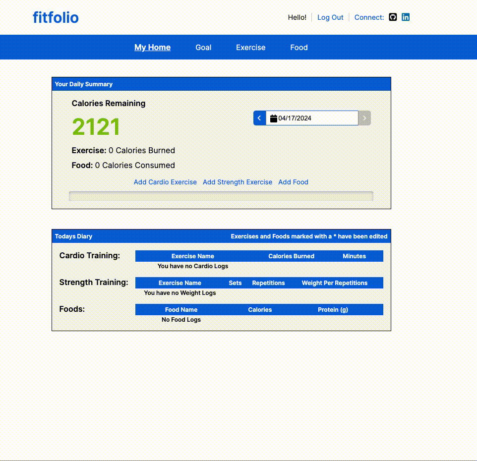
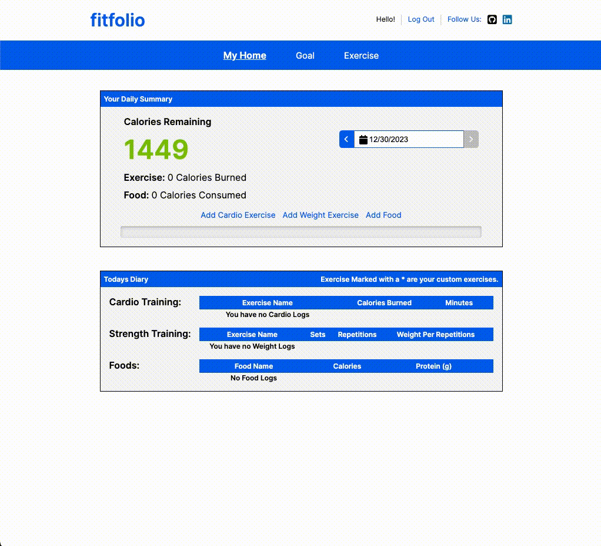

# FitFolio

A fitness tracking app developed with React, Redux, JavaScript, Python, PostgreSQL, and Flask. Designed for simplicity, FitFolio offers seamless progress tracking and an intuitive fitness monitoring experience. Elevate your fitness journey with the streamlined features of FitFolio.

## How to Use

1. Visit [FitFolio](https://fitfolio-f7l3.onrender.com)
2. Register for a new account or log in to your existing account.
3. Navigate to the nutrition tracking section to log your daily calorie intake.
4. Navigate to the exercise logging section to log your cardio and weight training sessions.

## Installation Instruction
1. Clone the repository: `git clone https://github.com/zohaibrajan/FitFolio.git`
2. Set up .env file, see .env.example for assistance
3. Install Dependencies: `pip install -r requirements.txt`
4. Set up virtual environment: `pipenv shell`
5. Database Setup, run the following commands
    - `flask db upgrade`
    - `flask seed all`
    - `flask run`
6. Open a New Terminal, navigate to the react-app folder: `cd react-app-folder`
7. Install Dependencies: `npm install`
8. Run application: `npm start`
9. Visit http://localhost:3000 in your browser to see the React application running.

## Features

* Personalized nutrition tracking: Keep track of your daily calorie intake and monitor your diet.
* Exercise logging: Log your cardio and weight training sessions and track your progress over time.

## Technologies Used
##### Frontend
   
##### Backend
 

##### Database, Deployment and Hosting
 
 
 

## Index
* [Feature List](https://github.com/zohaibrajan/FitFolio/wiki/Features-List)
* [Database Schema](https://github.com/zohaibrajan/FitFolio/wiki/Features-List)
* [User Stories](https://github.com/zohaibrajan/FitFolio/wiki/User-Stories)
* [Wireframes](https://github.com/zohaibrajan/FitFolio/wiki/Wire-Frames)

## API Endpoints
| Endpoint                                      | API Route                       | Description                               |
| --------------------------------------------------- | ------------------------------- | ------------------------------------------------- |
| **GET All Users:**                                | `/api/users`                    | Returns a list of all users.                        |
| **GET Specific User:**                            | `/api/users/<int:userId>`       | Returns information about a specific user.          |
| **GET User's Cardio Logs:**                       | `/api/users/cardio-logs/<string:date>` | Returns all cardio logs logged by the current user on a given date. |
| **GET Cardio Log by ID:**                         | `/api/users/cardio-logs/<int:cardioLogId>` | Returns a cardio log logged by the current user.    |
| **POST Cardio Log:**                              | `/api/users/cardio-logs`        | Creates a cardio log for the current user.          |
| **PUT Cardio Log by ID:**                         | `/api/users/cardio-logs/<int:cardioLogId>` | Updates a cardio log logged by the current user.    |
| **DELETE Cardio Log by ID:**                      | `/api/users/cardio-logs/<int:cardioLogId>` | Deletes a cardio log logged by the current user.    |
| **GET Weight Logs:**                              | `/api/users/weight-logs/<string:date>` | Returns all weight logs logged by the current user on a given date. |
| **GET Weight Log by ID:**                         | `/api/users/weight-logs/<int:weightLogId>` | Returns a weight log logged by the current user.    |
| **POST Weight Log:**                              | `/api/users/weight-logs`        | Creates a weight log for the current user.          |
| **PUT Weight Log by ID:**                         | `/api/users/weight-logs/<int:weightLogId>` | Updates a weight log logged by the current user.    |
| **DELETE Weight Log by ID:**                      | `/api/users/weight-logs/<int:weightLogId>` | Deletes a weight log logged by the current user.    |
| **GET Food Logs:**                                | `/api/users/food-logs/<string:date>` | Returns all food logs logged by the current user on a given date. |
| **GET Food Log by ID:**                           | `/api/users/food-logs/<int:foodLogId>` | Returns a food log logged by the current user.      |
| **POST Food Log:**                                | `/api/users/food-logs`          | Creates a food log for the current user.            |
| **PUT Food Log by ID:**                           | `/api/users/food-logs/<int:foodLogId>` | Updates a food log logged by the current user.      |
| **DELETE Food Log by ID:**                        | `/api/users/food-logs/<int:foodLogId>` | Deletes a food log logged by the current user.      |

### Landing Page

### Sign-up Page

### Home Page / Diary

<!-- ### Goal Page

### Exercise Page
 -->

## License
This project is licensed under the MIT License - see the [LICENSE.md](LICENSE.md) file for details.

### Let's Connect

